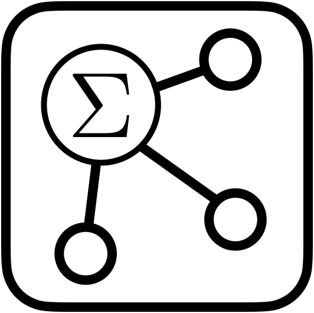

#  Freemath

Freemath is an innovative web application designed for creating and managing mathematical notes on an infinitely large canvas. Leveraging MathQuill for fast LaTeX editing of mathematical formulas, Freemath enables users to create various mathematical blocks and seamlessly connect them. The interactive environment allows for flexible note-taking and organization on a virtually limitless workspace.

## Getting Started

Freemath is an online application. To start using it, simply visit [https://freemath-mao.netlify.app/](https://freemath-mao.netlify.app/).

## Usage

| Action                         | Method                                                       |
| ------------------------------ | ------------------------------------------------------------ |
| Add New Note                   | `Double Click`                                               |
| Add New Equation               | <kbd>Enter</kbd>                                             |
| Switch Between Equation        | <kbd>⬆</kbd> or <kbd>⬇</kbd>                                 |
| Toogle Math / Text Mode        | <kbd>Cmd</kbd> + <kbd>/</kbd> ( in Windows <kbd>Ctrl</kbd> + <kbd>/</kbd> ) |
| Add Linking Path               | <kbd>Shift</kbd> + `Click Note(edge)` + `Drag`               |
| Move Note                      | `Drag Note(edge)`                                            |
| Move Canvas                    | `Drag Canvas(edge)` or `Scroll Wheel`                        |
| Delete Note                    | `Click Note` + <kbd>Backspace</kbd>                          |
| Export State to `JSON` file    | <kbd>Cmd</kbd> + <kbd>e</kbd> ( in Windows <kbd>Ctrl</kbd> + <kbd>e</kbd> ) |
| Import State from `JSON` file  | `Drag` + `Drop` the file                                     |
| Print the canvas to `PDF` file | <kbd>Cmd</kbd> + <kbd>p</kbd> ( in Windows <kbd>Ctrl</kbd> + <kbd>p</kbd> ) |
| Toogle Dark / Light Mode       | <kbd>Cmd</kbd> + <kbd>b</kbd> ( in Windows <kbd>Ctrl</kbd> + <kbd>b</kbd> ) |

## Limitations

Since this project is based on MathQuill, there are some limitations:

- Cannot **Undo** and **Redo** changes
- Cannot define new LaTeX commands
- Cannot use **alignment** or **matrix** environments

## Dependencies

- **MathQuill**: A library for LaTeX math editing. [MathQuill Documentation](https://github.com/mathquill/mathquill) 
- **jQuery**: MathQuill depends on jQuery for its functionality. [jQuery Documentation](https://jquery.com/)

## License

This project is licensed under the MIT License. See the [LICENSE](LICENSE) file for details.

## Contact

For any questions or feedback, please reach out to `jeffrey0613mao@gmail.com` or open an issue on GitHub.
